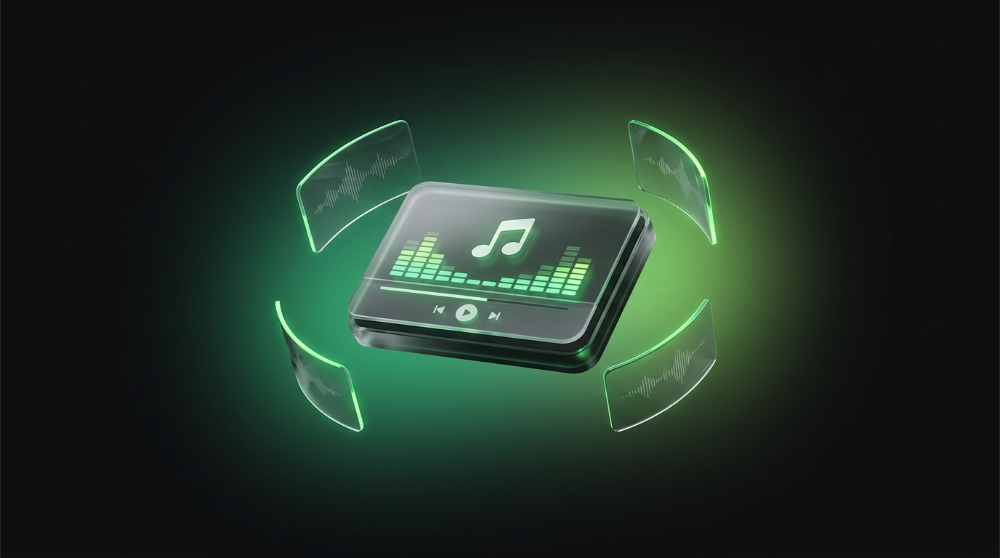
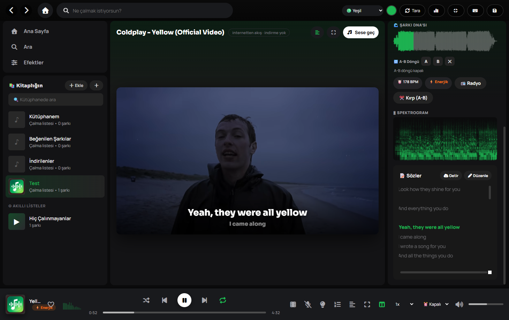
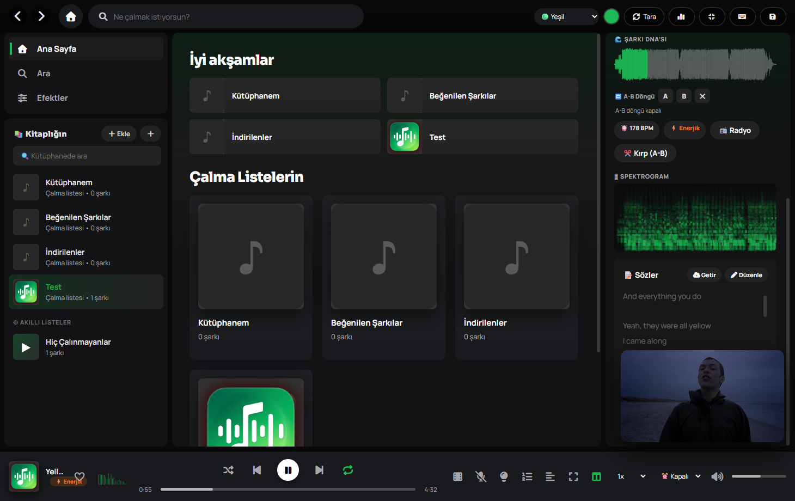

<p align="center">
  
</p>

<h1 align="center">🎵 Just Music Premium</h1>

<p align="center">
  Windows için profesyonel müzik çalar — <b>Spotify tarzı QtWebEngine arayüzü</b> +
  <b>yerli DSP ses motoru</b> (gerçek zamanlı EQ & efektler) + <b>gömülü yt-dlp/ffmpeg</b> +
  <b>htdemucs stüdyo karaoke</b> + <b>crossfade/gapless</b> + <b>Discord Rich Presence</b>.
</p>

<p align="center">
  <a href="https://github.com/barkeser2002/just-music-premium/releases/latest"></a>
  <a href="https://github.com/barkeser2002/just-music-premium/releases/latest/download/JustMusic-Setup.msi"></a>
  
  
  
  <a href="https://barkeser2002.github.io/just-music-premium/"></a>
</p>

## 📸 Ekran Görüntüleri

**Klip modu** — ekranı kaplamaz, ana alana gömülür; zaman kodlu sözler klibin üstünde senkron akar:



**Kalıcı mini oynatıcı** — sekme değiştirince klip köşeye iner ve çalmaya devam eder (akış kesilmez):



## ⬇ İndir & Kur (Windows)

**[⬇ JustMusic-Setup.msi indir](https://github.com/barkeser2002/just-music-premium/releases/latest/download/JustMusic-Setup.msi)** &nbsp;·&nbsp;
[Tüm sürümler](https://github.com/barkeser2002/just-music-premium/releases) &nbsp;·&nbsp;
[🌐 Tanıtım sayfası](https://barkeser2002.github.io/just-music-premium/)

- `.msi` **kullanıcı bazlı** kurar (yönetici/UAC gerekmez); Başlat menüsü + masaüstü kısayolu ekler.
- **Otomatik güncelleme:** uygulama açılışta GitHub'da yeni sürüm arar; varsa `.msi`'yi arka planda
  sessizce indirir ve **kapanışta kurup yeniden başlatır** (istersen "Şimdi yeniden başlat" ile hemen).
- `.msi` **GitHub Actions'ta bulutta** derlenir (bkz. `.github/workflows/build.yml`): `v*` etiketi
  push edilince ffmpeg/yt-dlp/deno indirilir, PyInstaller derler, **WiX** ile `.msi` paketlenir ve
  Release'e yüklenir.

## 🆕 v1.4.0 — daraltılabilir kabuk

- **📐 Daraltılabilir kenar çubuğu:** üst bardaki ☰ ile kenar çubuğu **tam (300px) ↔ ikon rayı (64px)**
  arasında geçer — içeriğe daha çok yer. Daralınca nav ikonları ve çalma listesi kapakları kalır,
  üzerine gelince isimleri **ipucu (tooltip)** olarak görünür. Durum kaydedilir; kısayol **B**, komut
  paletinde de var.
- **🪟 Kayan "Şimdi Çalıyor":** sağ panel çağrılınca **yumuşak kayarak** gelir (Apple Music tarzı çekmece),
  `prefers-reduced-motion` saygılı.

## 🆕 v1.3.0 — kesintisiz geçiş + Discord

- **🎚 Crossfade + boşluksuz (gapless) çalma:** parçalar arasında **eş-güçlü geçiş (0–12 sn)** ya da
  sınırda **boşluksuz** devam. Sıradaki parça önden çözülür → geçişte tek saniye boşluk/tıkırtı kalmaz.
  Albüm, canlı kayıt ve DJ setleri için. Varsayılan kapalı; sıralı çalmada devreye girer.
- **🎮 Discord Rich Presence:** çalan parça + oynat/duraklat durumu **Discord profilinde** görünür (opsiyonel).
  Ayarlardaki alana kendi **Discord Application ID**'ni gir, toggle'ı aç (Discord açık olmalı).
- Kontroller **Efektler → "Geçiş & Discord"** kartında (crossfade kaydırıcısı, gapless düğmesi, Discord). TR/EN.

## 🆕 v1.2.1 — theater modu

- **🎭 Theater modu:** tam ekran "Şimdi Çalıyor"da kapak solda, **zaman kodlu sözler sağda** yan yana;
  çalarken **aktif satır vurgulanır** (Apple Music tarzı sürükleyici görünüm).

## 🆕 v1.2.0 — modern görünüm

- **🫧 Cam arayüz (glassmorphism):** menüler, komut paleti, bildirimler, mini-oynatıcı ve alt player bar
  buzlu cam; arkasındaki içerik yumuşak blur'lü görünür.
- **🎨 Kapak-renginden adaptif tema:** çalan parçanın kapak rengi tüm arayüze (accent, görselleştirici,
  butonlar) yansır — okunabilir aralığa clamp'lenir; özel renk seçilince kapanır.
- **🖼 "Şimdi Çalıyor" hero:** sağ panel ve tam ekranda blurlu kapak arka planı (Apple Music tarzı immersive).
- **🎤 Dinamik söz adası:** yüzen cam söz penceresi — Enhanced-LRC ile **kelime kelime (karaoke)** vurgulanır,
  sürüklenebilir. `I` tuşu veya komut paletinden aç.
- **✨ Hareket:** kart/parça giriş animasyonu (kademeli), buton "spring" tepkileri.

## 🆕 v1.1.0

- **🌍 Dil desteği (TR + EN)** — üst bardaki dil seçicisinden anında geçiş; seçim kaydedilir.
  İç veri (mood, korumalı liste adları) Türkçe kalır, yalnız arayüz çevrilir — kütüphanen bozulmaz.

## 🆕 v1.0.4

- **📃 Playlist toplu indirme** — YouTube playlist URL'si → önizle, seç, X/Y sayaçlı toplu indir.
- **⬅➡ Geri / İleri gezinme** — üst bardaki oklar artık görünüm geçmişinde dolaşıyor.
- Düzeltmeler: komut paletinden karaoke menüsü artık kapanmıyor; arama/akıllı-liste görünümünde
  yanlışlıkla sürükle-sırala kaldırıldı; indirme/ayırma bildirimleri üst üste binmiyor.
- Bakım: **yt-dlp** güncellendi (YouTube tarafı değişince indirmedeki HTTP 403 düzeldi).

## 📚 Geliştirici Belgeleri

`docs/` altında — projeyi hızlı kavramak için:
[Mimari](docs/ARCHITECTURE.md) · [Köprü Sinyalleri](docs/BRIDGE-SIGNALS.md) ·
[Bilinen Sorunlar](docs/KNOWN-ISSUES.md) · [Geliştirici Rehberi + TR→EN sözlük](docs/DEV.md).
Kod grafiği: `graphify-out/` (`graphify query "..."`).

## 🏗 Mimari

- **Arayüz:** HTML/CSS/JS (`justmusic/web/`), `QWebEngineView` içinde render edilir →
  gerçek Spotify seviyesi görsel (gradyan başlıklar, kartlar, animasyonlar).
- **Ses & tüm mantık:** yerli Python (`engine.py` DSP motoru, `library.py`,
  `downloader.py`, `covers.py`, `naming.py`). Arayüz ↔ Python **QWebChannel**
  köprüsüyle konuşur (`bridge.py`).
- **Sunucu / port YOK:** her şey in-process. Varlıklar ve kapaklar özel `app://`
  şemasıyla servis edilir (`scheme.py`). Eski pywebview sürümündeki port
  çakışması / sonsuz kilitlenme burada imkânsız.

## ✨ Özellikler

- **Spotify düzeni:** üstte arama, solda kütüphane (kapaklı çalma listeleri),
  ortada gradyanlı liste görünümü + sütunlu şarkı tablosu, sağda "çalınıyor"
  paneli, altta player bar, ana sayfa kartları, şarkı sözleri görünümü.
- **Gerçek DSP ses motoru** (numpy/scipy + sounddevice): **30 EQ preset** +
  **10 bant özel EQ** + **🤖 Oto EQ** + efekt paneli (Preamp, Bass Boost, Echo,
  Reverb, **8D Spatial**) — çalarken anında. **Gerçek FFT görselleştirici**.
- **yt-dlp Python kütüphanesi** + gömülü `ffmpeg.exe`/`deno.exe`: kurulum
  gerekmez. **Ara → 20 sonucu kapaklarıyla gör → satıra tıkla, anında insin**
  (tek tık = tek indirme); dilersen **checkbox ile seçip toplu indir**; ya da
  bağlantı yapıştır → direkt mp3.
- **📃 Playlist toplu indirme:** YouTube **playlist URL'si** yapıştır → tüm
  parçalar kapaklarıyla önizlenir, **seç ve indir**; ilerleme **X/Y** sayacıyla
  gösterilir, hepsi "İndirilenler" listesine düşer. *(v1.0.4)*
- **🎤 Stüdyo karaoke (htdemucs / Demucs, YALNIZCA CPU):** şarkıyı gerçekten
  vokal + enstrüman olarak ayırır. Player'daki mikrofon düğmesi bir menü açar:
  **Enstrümantal** (karaoke), **Akapella** (sadece vokal), **⚡ Hızlı karaoke**
  (anında mid-side, motor gerektirmez) ve **Kapat**. Ayrılan stem'ler
  `~/Music/JustMusic/stems/` altında **önbelleğe** alınır → aynı şarkı bir daha
  ayrılmaz (anında geçiş). CPU'da ilk ayırma şarkı başına **~4-5 dk** sürer,
  ilerleme gösterilir; geçiş **çaldığın saniyeyi koruyarak** yapılır.
- **Akıllı isim & kapak:** dağınık MP3 adları temizlenip "Sanatçı - Başlık"a
  ayrıştırılır, bu temiz adla YouTube kapağı çekilir. "🖼 İsim & Kapak" ile toplu
  senkron.
- **Otomatik kütüphane:** `~/Music` taranır, her alt klasör bir çalma listesi.
- **Kuyruk (Sıradaki):** sıraya ekle / sıradaki çal, kuyruk sayfası.
- **Tam ekran "Şimdi Çalıyor":** kapak renginden gradyan + canlı görselleştirici.
- **İstatistik sayfası:** toplam parça/liste/süre + en çok dinlenenler (grafik).
- **Genel arama:** kütüphanede anında arar (şarkı+liste), Enter → YouTube indirme.
- **Kapak mozaiği** (2×2), **özel vurgu rengi** seçici, **gerçek şarkı süreleri**
  (ffmpeg ile), **indirme göstergesi**, **sürükle-bırak ile listeye ekleme**,
  **klavye kısayolları penceresi**, alt bar mini görselleştirici.
- **🎚 Crossfade + boşluksuz (gapless) geçiş:** sıradaki parça önden çözülür; eş-güçlü eritme (0–12 sn)
  veya sınırda boşluksuz devam. *(v1.3.0)*
- **🎮 Discord Rich Presence:** çalan parçayı Discord profilinde göster (opsiyonel, Client ID ile). *(v1.3.0)*
- **🎭 Theater modu:** tam ekranda kapak + senkron sözler yan yana, aktif satır vurgulu. *(v1.2.1)*
- **Premium tipografi:** gömülü Sora (başlıklar) + Manrope (gövde) fontları.

### 🚀 Çağ açıcı (bize özel DSP) özellikler
- **🎙 Karaoke / Vokal Azaltma:** gerçek zamanlı merkez-kanal iptaliyle vokali kısar.
- **🌈 Ruh Hali Motoru:** sesin enerji + parlaklığını analiz edip parçanın "ruh
  halini" (Enerjik/Sakin/Güçlü…) bulur, isteğe bağlı arayüz rengini ona uydurur.
- **🌊 Şarkı DNA'sı:** parçanın tüm dalga formu (SoundCloud tarzı) — tıklayarak seek.
- **🔁 A-B Döngü / Pratik Modu:** iki nokta arasında döngü (öğrenmek/çalışmak için).
- **💡 Ambiyans Işığı:** pencere kenarları müziğin rengi + bası ile titreşir.
- **🌊 Odak Sesleri:** DSP ile üretilen yağmur / beyaz / kahverengi gürültü
  (müzikle veya tek başına — odak/uyku için).
- **🎬 Klip Modu (akış — indirme yok):** alt bardaki film tuşu, çalan parçanın
  klibini **yt-dlp ile çözüp internetten oynatır** (`playVideo` → `VideoStreamThread`).
  Ekranı kaplamaz: Spotify gibi ana alana gömülür, kenar çubuğu + alt bar durur
  ve alt bar klibi sürer (oynat/duraklat, seek, ses). **"Sese geç"** ile müziğe
  dönülür — müzik varsayılan dinleme biçimidir. Zaman kodlu sözler varsa
  **klibin üstünde senkron** akar. YouTube'dan inen parçalarda kayıt birebir aynı
  olduğu için **konum iki yönde devredilir** (müziğin 40. sn'si → klip 40. sn'den).
  - **Kalıcı mini oynatıcı:** klip açıkken **sekme/menü değiştirmek akışı KESMEZ** —
    video, YouTube/Spotify gibi köşedeki bir **mini oynatıcıya** iner ve çalmaya
    devam eder; film tuşuna basınca yeniden büyür. Video/ses elementleri bir kez
    kurulup DOM'da yalnızca **taşınır** (yeniden yaratılmaz), böylece yt-dlp'yi her
    seferinde tekrar beklemek gerekmez.
  - Not: QtWebEngine H.264/AAC oynatamaz ve YouTube muxed webm vermez → VP9 video +
    Opus ses **ayrı akış** olarak gelir ve arayüzde senkron tutulur.

Ayrıca: 3 durumlu tekrar, liste sıralama, kompakt mod, dosya konumunu aç,
kalp animasyonu ve daha fazlası. Ses işleme tamamen yerli `DspEngine`'de.

### 🎤 Otomatik şarkı sözleri (Lyrica API)
- Bir parça çalınca sözü yoksa **otomatik** olarak
  [Lyrica](https://test-0k.onrender.com/) servisinden çekilir
  (`/lyrics/?artist=…&song=…&timestamps=true&fast=true`).
- Sözler **zaman kodlu (LRC)** gelir → satırlar çalarken **senkron vurgulanır**,
  satıra tıklayınca o ana atlar. Sanatçı bilgisi yoksa önce `/suggestion` ile bulunur.
- Sağ paneldeki **"Getir"** butonuyla elle de çekilebilir; kaynak (lrclib,
  Genius, Musixmatch…) bildirilir. Sözler kütüphaneye kaydedilir.

### 🧬 Daha da radikal (analiz + üretim)
- **BPM/tempo tespiti**, **ses eşitleme (loudness normalize)**, **spektrogram**,
  **zaman kodlu (LRC) şarkı sözleri** senkronu, **Komut Paleti (Ctrl+K)**,
  **Ruh Hali Radyosu**, **reverb ortam presetleri** (Oda/Salon/Katedral…),
  **parça kırpma & dışa aktarma** (A-B ile), **akıllı çalma listeleri**.
- Ayrıca: liste içi **sürükle-sırala**, **özel liste kapağı**, **M3U dışa aktar**,
  **tekrarları kaldır**, **tümünü kuyruğa ekle**, 12 tema, sıradaki önizleme.

### 🔧 İndirme mimarisi (ve düzeltmesi)
- Arama/indirme **yt-dlp'nin PYTHON kütüphanesiyle** yapılır (exe değil):
  gerçek ilerleme kancaları, dönüşüm sonrası **kesin dosya yolu**
  (`requested_downloads[].filepath`) ve anlaşılır hatalar.
- Modern yt-dlp, YouTube `nsig` korumasını çözmek için bir **JS çalışma zamanı**
  ister → **Deno** (`bin/deno.exe`) gömüldü; `config.py` `bin/`'i sürecin
  PATH'ine ekler, kütüphane Deno'yu otomatik bulur.
- Sonuç: "sonuç bulunamadı / indirme başarısız" giderildi (gerçek müzik videosu
  indirmesiyle doğrulandı).

### 🎨 İkonlar
Emoji tuşlar **FontAwesome** (gömülü) ile değiştirildi — renk ve arka plan
tema ile kontrol edilebilir.
- Sürükle-bırak, favoriler, künye düzenleme, listeler arası kopyalama, hız
  (0.5x–2x), ses boost (100+), uyku zamanlayıcı, 6 tema, JSON yedek.
- Klavye: `Boşluk` · `←/→` 10 sn · `↑/↓` ses · `S` karışık · `L` tekrar · `N/P`.

Veriler `~/Music/JustMusic/` altında (`library.json`, `downloads/`, `covers/`).

## 🛠 Kullanılan Araçlar

| Katman | Araç | Neden |
|--------|------|-------|
| **Arayüz kabuğu** | [PyQt6](https://pypi.org/project/PyQt6/) + **PyQt6-WebEngine** (`QWebEngineView`, `QWebChannel`) | Chromium tabanlı web arayüzü + JS↔Python köprüsü, sunucusuz |
| **Web arayüzü** | Saf **HTML/CSS/JS** (framework yok) | Spotify seviyesi görsel, tam kontrol |
| **Ses motoru** | [NumPy](https://numpy.org/) · [SciPy](https://scipy.org/) (`sosfilt`, `lfilter`) · [sounddevice](https://python-sounddevice.readthedocs.io/) | Gerçek zamanlı DSP: EQ, efektler, karaoke, FFT — `QMediaPlayer`'ın yapamadığı |
| **İndirme** | [yt-dlp](https://github.com/yt-dlp/yt-dlp) (**Python kütüphanesi**) | İlerleme kancaları + kesin dosya yolu + anlaşılır hata |
| **Kod çözme / MP3** | [FFmpeg](https://ffmpeg.org/) (gömülü `ffmpeg.exe`) | Her biçimi f32 PCM'e çöz, mp3 dönüştür |
| **JS çalışma zamanı** | [Deno](https://deno.com/) (gömülü `deno.exe`) | YouTube `nsig` korumasını çözmek için şart |
| **Şarkı sözleri** | [Lyrica API](https://test-0k.onrender.com/) | Zaman kodlu (LRC) senkron sözler |
| **İkonlar** | [Font Awesome Free](https://fontawesome.com/) (gömülü, çevrimdışı) | SVG ikon — rengi/arka planı tema ile değişir |
| **Tipografi** | [Sora](https://fonts.google.com/specimen/Sora) + [Manrope](https://fonts.google.com/specimen/Manrope) (gömülü) | Başlık + gövde fontları (latin-ext = Türkçe) |
| **Paketleme** | [PyInstaller](https://pyinstaller.org/) | Tek `dist\JustMusic\` klasörü (WebEngine + bin + web gömülü) |
| **Logo** | [OpenRouter](https://openrouter.ai/) → Google **Nano Banana Pro** (Gemini Image) | `logo.png` + `logo.ico` üretimi |

> Ses **tarayıcıda değil**, tamamen yerli `DspEngine`'de (sounddevice) çalınır;
> QtWebEngine yalnızca görseldir. Böylece EQ/efekt kalitesi ve "sunucu yok" garantisi korunur.

## 🧩 Kurulum & Çalıştırma

```bat
setup.bat      REM .venv + bağımlılıklar (PyQt6, PyQt6-WebEngine, numpy, scipy, sounddevice, yt-dlp)
run.bat        REM çalıştır
build.bat      REM dist\JustMusic\JustMusic.exe üret (~880 MB; WebEngine+ffmpeg gömülü)
```

> **Gömülü ikili araçlar depoda yok** (GitHub 100 MB/dosya sınırı). Çalıştırmadan
> önce `bin/` klasörüne şunları koyun: **`ffmpeg.exe`** ([indir](https://www.gyan.dev/ffmpeg/builds/)),
> **`yt-dlp.exe`** ([indir](https://github.com/yt-dlp/yt-dlp/releases)),
> **`deno.exe`** ([indir](https://github.com/denoland/deno/releases)).
> (yt-dlp Python kütüphane olarak da `requirements.txt` üzerinden kurulur; `bin/`'deki
> exe yalnızca yedektir. `ffmpeg` ve `deno` zorunludur.)

## 📁 Yapı

```
main.py                # QtWebEngine giriş noktası (şema + köprü + pencere)
justmusic/
  bridge.py            # JS↔Python köprüsü (KONTROLÖR): ses, kütüphane, indirme, EQ
  scheme.py            # app:// özel şema (web varlıkları + kapaklar)
  engine.py            # DSP motoru (EQ+efekt+hız+FFT) — projenin kalbi
  eqpresets.py         # 30 EQ profili + bant/efekt tanımları
  library.py           # veri modeli + JSON + müzik klasörü tarama
  downloader.py        # yt-dlp PYTHON kütüphanesi ile indirme (+ffmpeg mp3)
  covers.py            # yt-dlp PYTHON kütüphanesi ile kapak arama/önbellek
  naming.py            # MP3 adı temizleme
  config.py            # yollar, gömülü bin/web çözümleme
  web/                 # index.html, app.css, app.js, qwebchannel.js + fontawesome/ + fonts/
  assets/logo.png
bin/ffmpeg.exe  bin/deno.exe  bin/yt-dlp.exe   # depoda YOK — kendiniz indirin (deno: nsig/JS çözümü)
docs/                  # README ekran görüntüleri
setup.bat  run.bat  build.bat  build.py  requirements.txt
```

## ℹ️ Not

Ses **tarayıcıda değil**, tamamen yerli `DspEngine`'de (sounddevice) çalınır;
QtWebEngine yalnızca görseldir. Hız artışı pitch'i değiştirir (nightcore); reverb
çok-taplı "oda" hissidir.
